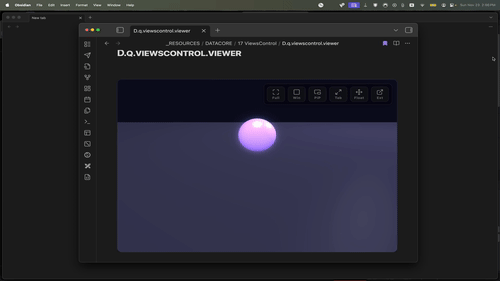

  
  
  <h1 align="center">VIEWS CONTROL</h1>
  <h3 align="center"> A 3D Sᴀɴᴅʙᴏx wɪᴛʜ Mᴜʟᴛɪ-Dɪsᴘʟᴀʏ Vɪᴇᴡᴘᴏʀᴛ Cᴏɴᴛʀᴏʟs </h3>

  <!-- TOP PURPLE LINKS -->
  
  
  
   
  <!-- BOTTOM GOLD TAXONOMY -->
  
  
  
  

  
<i>A 3D sandbox demonstrating advanced display modes, including a true detachable OS-level window, native PiP, and floating panels.</i>

---

## 📌 Introduction & Overview

**Views Control** is an interactive 3D sandbox built with BabylonJS and React, demonstrating advanced viewport and screen-mode management natively inside Datacore. It allows rendering an interactive 3D canvas that can dynamically transform between various layout modes, including inline display, full-pane coverage, floating draggable panels, native picture-in-picture, and a detached native OS-level window for multi-monitor setups.

---

## ✨ Features

### 🎮 Interactive 3D Sandbox
* **Babylon.js Scene**: Renders a live 3D world featuring a player sphere controlled via standard keyboard inputs (`WASD` or Arrow Keys).
* **Lighting & Camera**: Includes hemispheric and point lighting, standard orbit/zoom constraints, and a glow layer for visual feedback.

### 🎛️ Advanced Display & Viewport Modes
* **External Window**: Detaches the 3D scene into a separate, native OS-level window using Electron's `BrowserWindow` API (ideal for multi-monitor setups).
* **Native PiP (Picture-in-Picture)**: Creates a floating, system-level video overlay of the 3D canvas that stays on top of other desktop applications (view-only).
* **Float Mode (Interactive PiP)**: Reparents the canvas to a floating, draggable, and corner-resizable overlay within the main application workspace.
* **Full Tab**: Maximizes the 3D view to occupy the entire workspace pane, dynamically suppressing the application's global status bar and view footers for an immersive experience.

### 🛡️ Robust DOM & Lifecycle Management
* **Resize observer**: Integrates a debounced `ResizeObserver` paired with `requestAnimationFrame` render loop coordination to prevent WebGL context collapse.
* **Inter-Window Communication**: Detects mode-switch actions inside detached processes and gracefully relays layout requests back to the master window upon closure.

---

## 📦 Directory Index & Components

The package exposes the following compiled files:

| File | Description |
| :--- | :--- |
| **[VIEWS CONTROL.md](VIEWS%20CONTROL.md)** | The main entry point configured with declarative frontmatter. |
| **[src/index.jsx](src/index.jsx)** | The dynamic bootstrapper script that loads the application interface. |
| **[src/App.jsx](src/App.jsx)** | The core UI orchestrator holding overlays, HUD layout, and main game loop. |
| **[src/components/ScreenModeHelper.jsx](src/components/ScreenModeHelper.jsx)** | Manages window state transitions and reparenting styles. |
| **[METADATA.md](METADATA.md)** | YAML taxonomy manifest mapping component settings, compatibility, and target. |
| **[CONTRIBUTING.md](CONTRIBUTING.md)** | Engineering standards and contributor guidelines. |
| **[LICENSE.md](LICENSE.md)** | The MIT permissible software distribution license. |
| **[assets/viewscontrol.clip.gif](assets/viewscontrol.clip.gif)** | Optimised loop animation demonstrating display modes. |
| **[assets/views_control.webp](assets/views_control.webp)** | Standard components preview image. |

---

## Contributors

- **beto.group** — Core architecture and display modes development.
