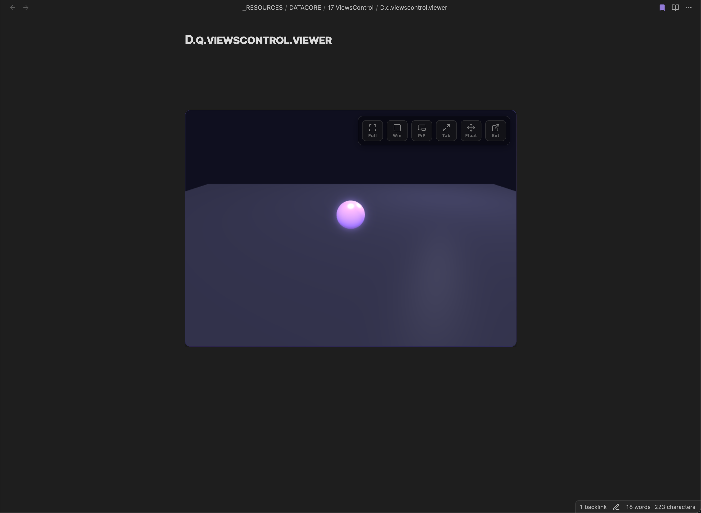

  
  
  <h1 align="center">VIEWS CONTROL</h1>
  <h3 align="center"> The 3D Sandbox with Multi-Display Viewport Controls </h3>

  <!-- TOP PURPLE LINKS -->
  
  
  
   
  <!-- BOTTOM GOLD TAXONOMY -->
  
  
  
  

  

    <i> A 3D sandbox demonstrating advanced display modes, including a true detachable OS-level window, native PiP, and floating panels. </i>
  

  

Welcome to **Views Control**, the advanced 3D viewport sandbox built natively for Obsidian Datacore. By pairing a responsive Babylon.js WebGL engine with native system and browser APIs, it exposes tools to run a single 3D scene across multiple display targets. The canvas can transition instantly from an inline layout into fullscreen, floating draggable views, native picture-in-picture, or a completely separate OS-level monitor window.

---

## Quick Start

To start trying Views Control today:
1. **Download the Repository**: Clone or download this repository directly into any folder inside your Obsidian vault.
2. **Install Datacore**: Ensure you have the **Datacore** plugin installed and enabled in Obsidian.
3. **Open the Entry Note**: Open the **`VIEWS CONTROL.md`** note inside Obsidian to launch the component!

---

## Features

### Interactive 3D WebGL Sandbox
* **Babylon.js Canvas**: Renders a live 3D sandbox containing player controls, hemispheric lights, point lights, and dynamic rendering loops.
* **Control Bindings**: Use WASD or Arrow Keys to move the player sphere across the gridded plane in real-time.
* **Orbit Camera Constraints**: Restricts maximum and minimum camera radii to avoid viewport clipping or coordinate misalignment.

### Dynamic Viewport Layouts
* **External Monitor Window**: Spawns a dedicated OS-level display window utilizing Electron APIs for desktop vault environments.
* **Native PiP Overlay**: Pipes a browser-level picture-in-picture video stream overlay to keep the canvas visible over outside applications.
* **Draggable Float Panels**: Reparents the WebGL canvas into a floating, resizable pane styled with glassmorphism effects inside the workspace.
* **Full Tab Coverage**: Maximizes display coverage while automatically injecting style sheets to hide parent note headers and footer boundaries.

### Engine Stabilization
* **Resize Observer Loops**: Debounces canvas resize callbacks to eliminate layout jitter and prevent WebGL context loss.
* **Window State Recovery**: Relays navigation commands back to the master window parent if the external window process is terminated.

---

## Directory Index & Components

The package exposes the following compiled files:

| File | Description |
| :--- | :--- |
| **[VIEWS CONTROL.md](VIEWS%20CONTROL.md)** | The main loader query designed to be opened in any Obsidian workspace tab. |
| **[src/index.jsx](src/index.jsx)** | Main lifecycle loader. |
| **[src/App.jsx](src/App.jsx)** | React layout orchestrator hosting the WebGL engine and controller event loops. |
| **[src/components/ScreenModeHelper.jsx](src/components/ScreenModeHelper.jsx)** | Handles display state transitions, reparenting logic, and Electron APIs. |
| **[METADATA.md](METADATA.md)** | Packaging manifest outlining taxonomy and asset locations. |
| **[README.md](README.md)** | Comprehensive premium user documentation. |
| **[assets/image/preview_1.webp](assets/image/preview_1.webp)** | High-fidelity static preview image of the component. |
| **[assets/videos/preview.gif](assets/videos/preview.gif)** | Lanczos-compressed walkthrough loop walkthrough GIF. |

---

## Previews

| Card Layout | Interactive 3D Explorer |
| :---: | :---: |
|  |  |

---

## Contributors
- beto.group
